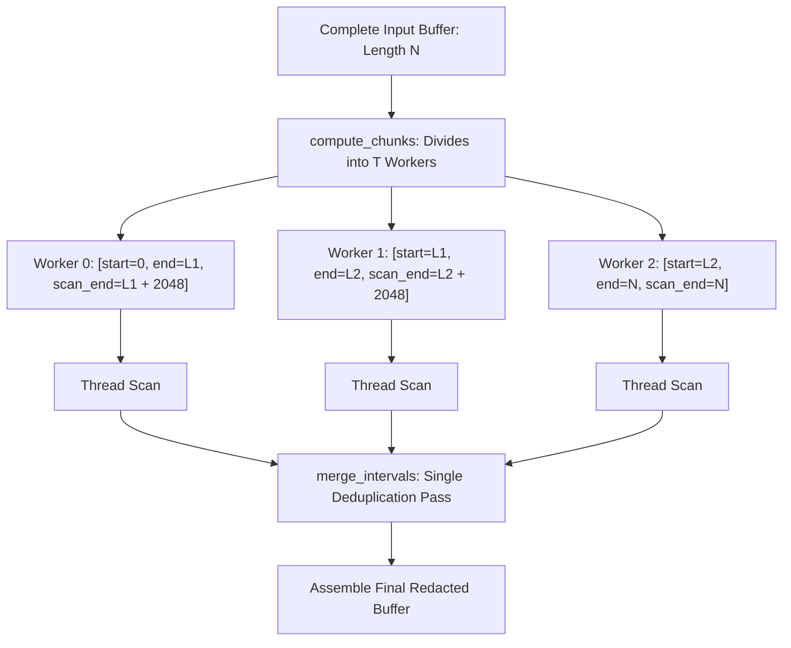

# Overlap-Aware Multi-Threading & Zero-GIL Concurrency 🧵

When scrubbing large files (100 MB to 10+ GB), splitting text naively across thread boundaries creates a dangerous vulnerability: **secrets spanning across the chunk boundary will be split in half and missed by the detector.**

`fastscrub` solves this with an **overlap-aware chunking architecture** and a **zero-GIL C++ thread pool**.

---

## 1. The Chunk Boundary Fracture Problem

Suppose a 300-byte JWT token or database connection string sits directly across the boundary between Thread 1 and Thread 2:

```text
[ ... Thread 1 Slice ... eyJhbGciOiJ ] | [ IUzI1NiIsInR5cCI6IkpXVCJ9 ... Thread 2 Slice ... ]
                                      ^
                               Boundary Cut
```

A standard multi-threaded string processor gives each thread only its assigned slice. Neither thread sees the full token, causing a **critical false negative (data leak)**.

---

## 2. FastScrub Overlap-Aware Chunking

`fastscrub` extends each worker thread's scanning range by a **2,048-byte safe overlap window**:



### Mathematical Invariants
1. **Zero Secret Loss**: Every secret up to 2,048 bytes long is guaranteed to be fully contained within at least one worker's scanning window.
2. **Deterministic Deduplication**: Overlapping detections are merged using `merge_intervals()`, ensuring exact interval bounds and zero double-masking.

---

## 3. GIL-Free C++ Worker Pools

In Python, multi-threading in pure Python code is serialized by the Global Interpreter Lock (GIL). 

In `fastscrub`:
1. The Python entry point (`scrub_bulk` or `scrub_list`) acquires raw pointers to the underlying character memory.
2. Invokes `nanobind::gil_scoped_release release;`.
3. Spawns standard OS threads (`std::thread`) that run 100% in native machine code across all physical CPU cores simultaneously.
4. Re-acquires the GIL only when creating the return Python object.

This achieves linear throughput scaling with CPU core count.
