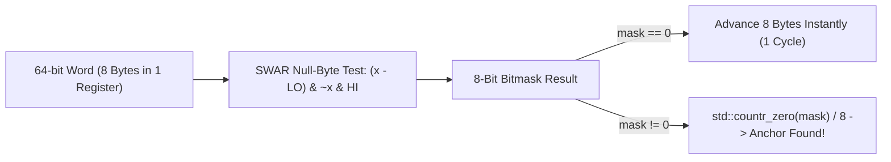

# 64-Bit SWAR Vectorization & Fast Guards ⚡

This document explains the core C++20 algorithmic innovations that allow `fastscrub` to process text at **100+ MB/s** without relying on traditional regex backends.

---

## 1. The Regex Bottleneck

Traditional PII redaction libraries (like Microsoft Presidio or pure Python regex) use non-deterministic finite automata (NFA) or deterministic finite automata (DFA). 

When processing large logs, standard regex engines suffer from:
1. **Character-by-character iteration**: Inspecting 1 byte at a time forces 1 billion loop cycles per gigabyte.
2. **Branch mispredictions**: Irregular log formats cause CPU pipeline flushes.
3. **Catastrophic backtracking**: Complex nested patterns freeze threads on malformed inputs.

---

## 2. SIMD-Within-A-Register (SWAR) Bit-Twiddling

Instead of inspecting 1 byte at a time, `fastscrub` loads **8 bytes at once into a standard 64-bit integer register (`uint64_t`)** and performs parallel bitwise tests in a single CPU clock cycle.

### The Bitwise Math

To detect whether an 8-byte integer word contains a target character $T$ (e.g. `@` or `-`):

$$\text{pattern} = \text{LO} \times T \quad (\text{where } \text{LO} = \text{0x0101010101010101})$$
$$x = \text{word} \oplus \text{pattern}$$
$$\text{match} = (x - \text{LO}) \ \& \ (\sim x) \ \& \ \text{HI} \quad (\text{where } \text{HI} = \text{0x8080808080808080})$$

If $\text{match} == 0$, the word contains **none** of the target characters, allowing the scanner to advance 8 bytes forward in 1 CPU cycle!

When a match is found, `std::countr_zero(match) / 8` yields the exact byte offset in 1 CPU cycle using hardware instructions (`tzcnt` on x86, `rbit` on ARM).

---

## 3. High-Entropy Anchor Routing

`fastscrub` groups all sensitive entities by their structural punctuation anchors:

| Anchor | Target Entities |
|---|---|
| `@` | RFC 5322 Emails |
| `_` | GitHub tokens (`ghp_`), Stripe keys (`sk_live_`), HuggingFace tokens (`hf_`) |
| `-` | OpenAI (`sk-proj-`), Anthropic (`sk-ant-`), GitLab (`glpat-`), PyPI (`pypi-`), Slack (`xoxb-`), UUIDs, SSNs |
| `.` | HashiCorp Vault (`hvs.`), JWTs (`eyJ...`), IPv4 |
| `:` | Database URIs (`postgres://`, `mongodb://`), IPv6, MAC addresses |
| `A` | Floating AWS Access Key IDs (`AKIA`, `ASIA`, `ABIA`, `AROA`, `AIDA`) |

---

## 4. 1-Cycle Fast Rejection Guards

Production server logs contain millions of timestamps (`2026-08-21T04:15:30.123Z`) and snake_case variables that contain punctuation (`-`, `.`, `_`). 

Without guards, structural parsers would trigger constantly on harmless log syntax. `fastscrub` uses **1-cycle rejection guards**:

* **ISO8601 1-Leap Bypass**: When encountering `YYYY-` or `HH:`, the scanner immediately leaps forward 5 bytes, skipping all expensive parsing passes.
* **Anchor Substring Guards**: `.` only invokes `parse_jwt` if preceded by `eyJ`, and `:` only invokes `parse_connection_string` if followed by `://`.
* **Direct Token Boundary Isolation**: Key-value secrets (`password=`, `api_key:`) extract only the immediate preceding token and enforce length limits before comparing strings.
