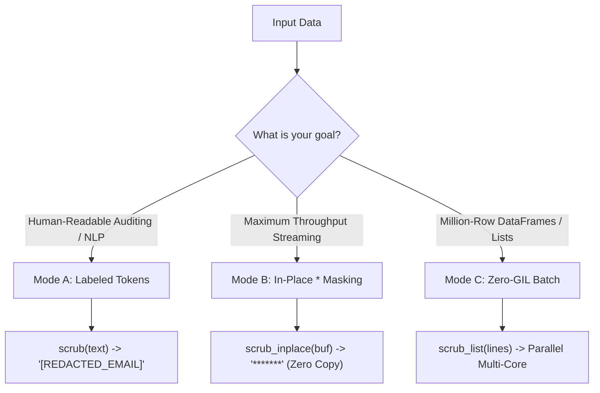

# Operational Modes: Choosing the Right Strategy 🎯

`fastscrub` provides three distinct operational modes, each optimized for different stages of the data engineering and analytics pipeline.



---

## Comparison Matrix

| Feature / Metric | Mode A: Labeled Replacement | Mode B: In-Place Masking | Mode C: Batch Processing |
|---|---|---|---|
| **Function** | `scrub(text)` | `scrub_inplace(bytearray)` | `scrub_list(lines)` |
| **Mask Format** | Descriptive tag (e.g. `[REDACTED_IP]`) | Character overwrite (`*`) | Descriptive tags or custom |
| **Output Type** | New `str` | Mutates existing `bytearray` | List of new `str` |
| **Heap Allocations** | Allocates replacement string | **0 Allocations (True Zero Copy)** | Minimal (C++ vectors) |
| **GIL Behavior** | Sequential or auto-chunked | Released in bulk mode | **Completely Released** |
| **Ideal For** | LLM ingestion, audits, UI display | Log ingest pipelines, Kafka, sockets | DataFrames, Polars, ETL batches |

---

## 1. Mode A: Labeled Token Replacement (`scrub`)

### When to Use
Use Mode A when downstream consumers (such as LLMs, compliance auditors, or search indices) need to know **what kind of entity** was removed.

### How It Works
1. Scans the input text using 64-bit SWAR bit-twiddling.
2. Identifies exact character intervals for all sensitive entities.
3. Computes exact output string size and performs a single contiguous memory allocation.
4. Assembles the final string with descriptive tags (`[REDACTED_EMAIL]`, `[REDACTED_AWS_KEY]`).

```python
from fastscrub import scrub

log = "Failed login for admin@domain.com from IP 192.168.1.1"
print(scrub(log))
# Output: "Failed login for [REDACTED_EMAIL] from IP [REDACTED_IP]"
```

---

## 2. Mode B: Zero-Allocation In-Place Mutation (`scrub_inplace`)

### When to Use
Use Mode B when **maximum throughput** and **minimal memory overhead** are required (e.g., high-throughput log shippers, network proxies, or real-time event routers).

### How It Works
1. Accepts a mutable Python `bytearray` directly in RAM.
2. The C++ worker threads iterate over the buffer and overwrite sensitive bytes directly with `*`.
3. **Zero heap allocation is performed**: no `std::vector` intervals, no sorting passes, and no string reassembly.
4. The buffer length and structure remain 100% identical.

```python
from fastscrub import scrub_inplace

# Read network chunk into bytearray
network_chunk = bytearray(b"GET /api/user?token=ghp_YOUR_GITHUB_TOKEN HTTP/1.1")

# Mutate directly in RAM
scrub_inplace(network_chunk)

print(network_chunk.decode('utf-8'))
# Output: "GET /api/user?token=******************** HTTP/1.1"
```

---

## 3. Mode C: Zero-GIL Multi-Core Batch Processing (`scrub_list`)

### When to Use
Use Mode C when processing batches of strings from Pandas/Polars DataFrames, CSV files, or database queries.

### How It Works
1. Extracts C-level string pointers from the Python list into C++ in a zero-copy pass.
2. Immediately releases the Python Global Interpreter Lock (GIL).
3. Distributes items across a lock-free atomic work queue across all CPU worker threads.
4. Re-acquires the GIL only to package the final result list.

```python
import polars as pl
from fastscrub import scrub_list

# Load DataFrame
df = pl.DataFrame({
    "raw_logs": [
        "User 123-45-6789 created ticket",
        "API call with token sk-proj-YOUR_OPENAI_KEY",
        "Connected to database at 10.0.0.15"
    ]
})

# Process 1,000,000+ rows across all CPU cores
cleaned_logs = scrub_list(df["raw_logs"].to_list())
df = df.with_columns(pl.Series("cleaned_logs", cleaned_logs))
```
